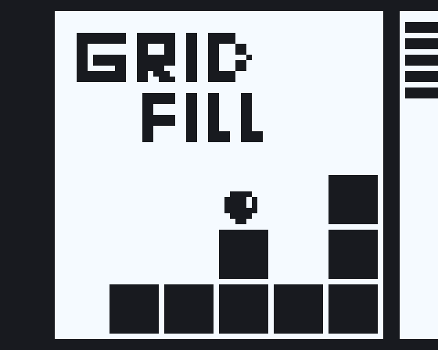

# Grid Fill
## Ludum Dare 50

How long can you last before the screen *inevitably* fills up?

## Gameplay

Navigate the 10x10 grid of blocks while they slowly fill up. The speed slowly increases, but you can use 5 abilities to help you survive for longer.

To use an ability, press the corresponding button and complete the timer minigame on the side by pressing E.

If you stand inside a block when it is done growing, you lose!

## Controls:
A/D - Move  
W/Space - Jump  
1,2,3,4,5 or cursor - Select Ability  
E - Confirm Timer  

## Software Used

+ Godot
+ Aseprite
+ Bfxr

*Sorry for any spelling errors*